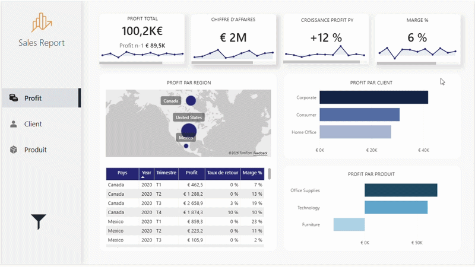
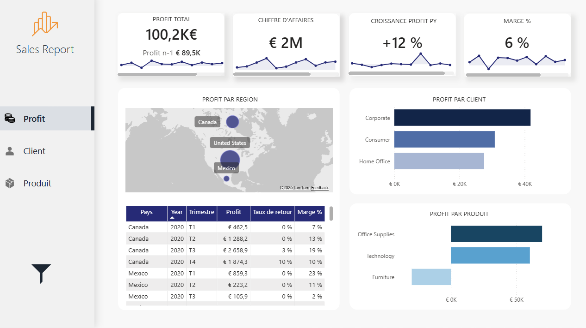
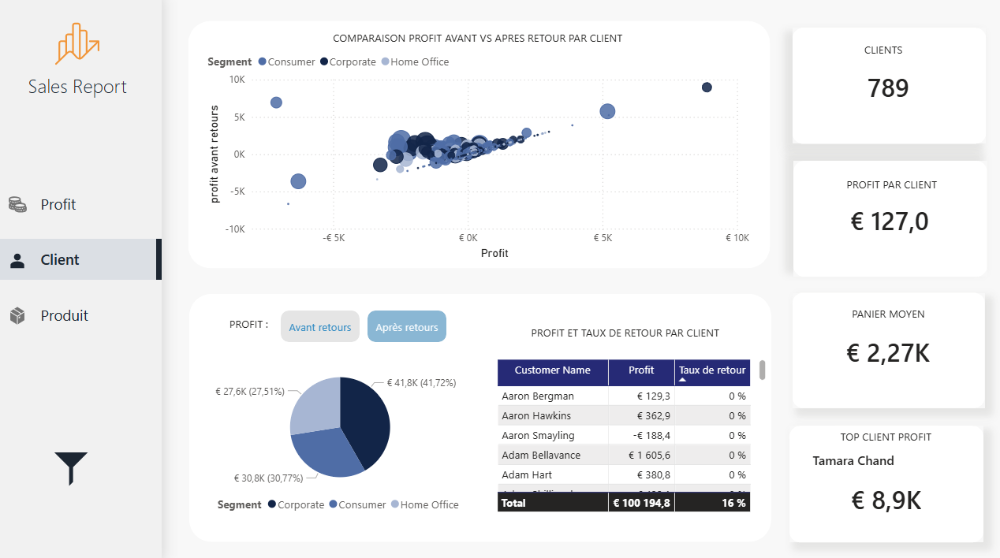
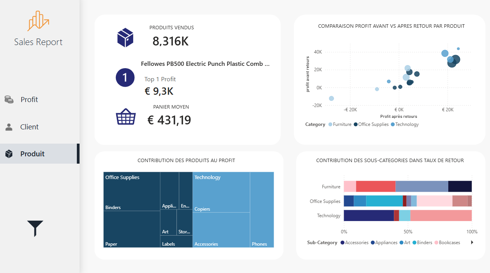
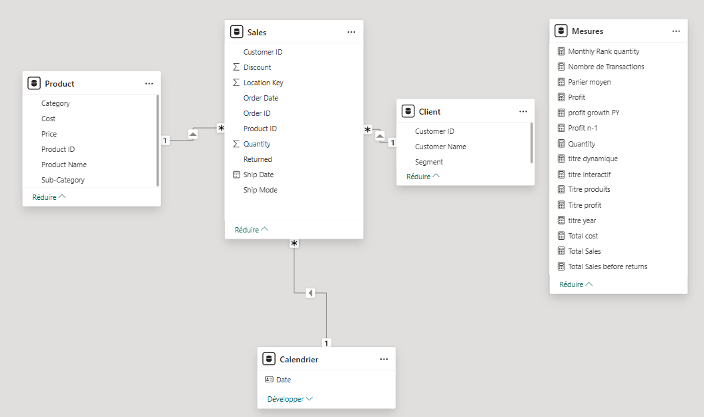

# Analyse_des_ventes_dashboard

## Contexte

L’entreprise évolue dans un environnement Retail/Distribution. Les données de ventes disponibles permettent de suivre l’activité commerciale, mais nécessitent une structuration et une analyse approfondie afin de mieux comprendre la rentabilité, la performance des produits et la contribution des clients stratégiques à la croissance de l’entreprise.

Dans ce contexte, ce projet vise à transformer les données de ventes en indicateurs de performance clairs et exploitables, à travers un tableau de bord Power BI.

## Objectifs de la mission

- Analyser l’évolution temporelle du profit
- Évaluer la performance des produits par catégorie
- Identifier les clients les plus performants par segment
- Mettre à disposition des KPIs fiables et actionnables
- Faciliter le pilotage de la performance commerciale

## Solutions mises en œuvre

- Modélisation des données de ventes dans Power BI
- Création de mesures et indicateurs clés à l’aide de DAX
- Développement de visualisations interactives et dynamiques
- Structuration du rapport en trois axes d’analyse :
  - Analyse temporelle du profit
  - Performance des produits
  - Analyse des meilleurs clients
- Optimisation de l'expérience utilisateur

## Visualisation du rapport

## Présentation du rapport 

## Analyse du profit 

**Objectif :** D’où vient réellement le profit ?

Cette page permet d’évaluer la performance globale et d’identifier les principaux leviers de rentabilité.

**Questions clés :**

- L'entreprise est-elle performante ? (profit, marge, évolution)  
- Quelles régions génèrent le plus de valeur ?  
- Quels segments contribuent le plus au profit ?  
- Quelles dimensions expliquent les variations de performance ?  

## Analyse client
**Objectif :** Qui sont les meilleurs clients ?

Cette page met en évidence la concentration du profit et l’impact des retours sur la rentabilité réelle.

**Questions clés :**

- Le profit est-il concentré sur quelques clients ?  
- Les retours modifient-ils la rentabilité réelle des clients ?

## Analyse produit

**Objectif :** Quels produits créent ou détruisent la valeur ?

Cette page identifie les produits stratégiques et ceux à optimiser.

**Questions clés :**

- Quels produits génèrent le plus de profit ?   
- Quels produits deviennent moins rentables à cause des retours ?  

- `Modélisation des données/`

## Outils et technologies

- Power BI
- Power Query
- DAX
- Modélisation de données
- Data Visualization

## Auteur
**Ikram Ettafki**  
Data Analyst
